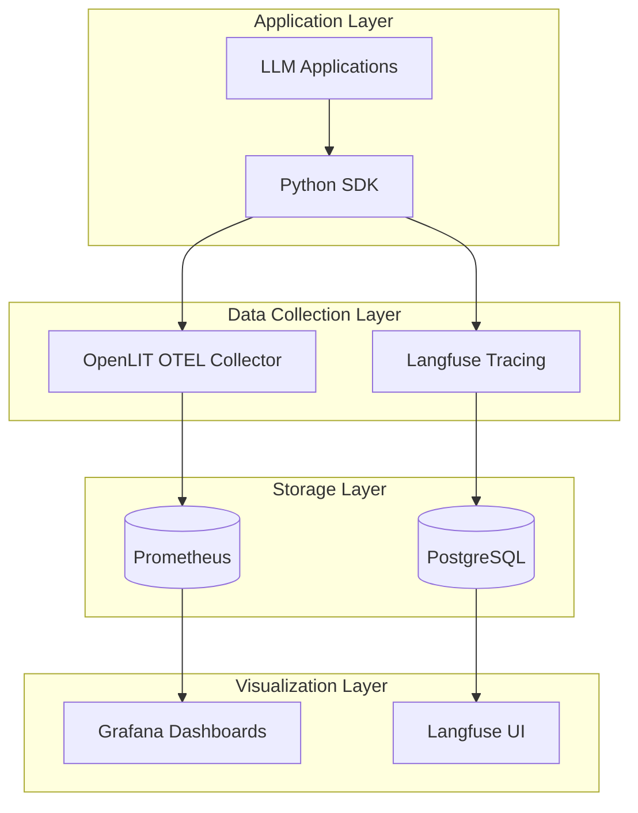
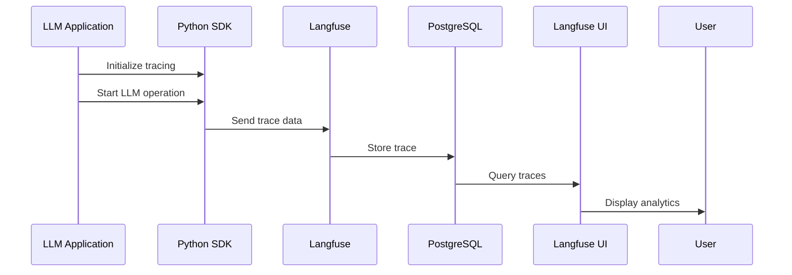
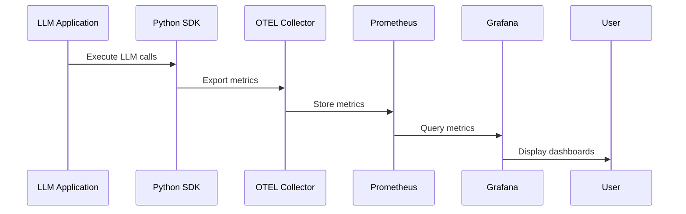

# Lang Observatory Architecture

## Overview

Lang Observatory is a turnkey observability stack for Large Language Model (LLM) applications, packaged as a Helm chart. It provides comprehensive monitoring, tracing, and analytics capabilities for LLM workloads running in Kubernetes environments.

## System Architecture



## Component Architecture

### Core Components

#### 1. Langfuse
- **Purpose**: LLM tracing and observability platform
- **Technology**: Next.js application with PostgreSQL backend
- **Responsibilities**:
  - Trace collection and storage
  - LLM conversation analysis
  - Cost tracking and analytics
  - User session management

#### 2. OpenLIT
- **Purpose**: OpenTelemetry-based LLM observability
- **Technology**: OTEL Collector with custom processors
- **Responsibilities**:
  - Metrics collection and aggregation
  - Performance monitoring
  - Custom LLM metrics export
  - Integration with observability ecosystems

#### 3. Prometheus
- **Purpose**: Time-series metrics storage and alerting
- **Technology**: Prometheus server with custom rules
- **Responsibilities**:
  - Metrics ingestion from OTEL collector
  - Alert rule evaluation
  - Historical data retention
  - PromQL query interface

#### 4. Grafana
- **Purpose**: Metrics visualization and dashboarding
- **Technology**: Grafana with custom dashboards
- **Responsibilities**:
  - Real-time metrics visualization
  - Custom LLM dashboards
  - Alert visualization
  - Multi-datasource correlation

## Data Flow Architecture

### 1. Trace Collection Flow



### 2. Metrics Collection Flow



## Deployment Architecture

### Kubernetes Resources

#### 1. Namespacing Strategy
- **Primary Namespace**: `lang-observatory`
- **Isolation**: Network policies for component isolation
- **RBAC**: Minimal privilege access controls

#### 2. Service Mesh Integration
- **Ingress**: Support for multiple ingress controllers
- **Load Balancing**: Service-level load balancing
- **TLS**: End-to-end encryption support

#### 3. Storage Strategy
- **Persistent Volumes**: For Prometheus and PostgreSQL data
- **Backup**: Automated backup strategies
- **Scaling**: Horizontal scaling for stateless components

## Security Architecture

### 1. Authentication & Authorization
- **RBAC**: Kubernetes role-based access control
- **Service Accounts**: Dedicated service accounts per component
- **Network Policies**: Micro-segmentation

### 2. Data Protection
- **Encryption in Transit**: TLS for all communications
- **Encryption at Rest**: Database and storage encryption
- **Secret Management**: Kubernetes secrets integration

### 3. Compliance
- **Pod Security Standards**: Restricted security policies
- **Container Security**: Non-root execution, read-only filesystems
- **Audit Logging**: Comprehensive audit trails

## Scalability Architecture

### 1. Horizontal Scaling
- **Stateless Components**: Auto-scaling for web interfaces
- **Load Distribution**: Multi-replica deployments
- **Resource Management**: CPU/Memory limits and requests

### 2. Data Scaling
- **Prometheus**: Federation and remote storage
- **PostgreSQL**: Read replicas and connection pooling
- **OTEL**: Collector scaling and load balancing

### 3. Performance Optimization
- **Caching**: Redis integration for session management
- **Compression**: Data compression for storage efficiency
- **Indexing**: Optimized database indexing strategies

## Integration Architecture

### 1. External Systems
- **CI/CD**: GitHub Actions integration
- **Alerting**: Slack, PagerDuty, email notifications
- **Monitoring**: External monitoring system integration

### 2. API Architecture
- **REST APIs**: Standard HTTP/JSON interfaces
- **GraphQL**: Advanced query capabilities
- **Webhooks**: Event-driven integrations

### 3. SDK Architecture
- **Python SDK**: Primary integration library
- **OpenTelemetry**: Standard observability protocols
- **Custom Exporters**: Framework-specific integrations

## Operational Architecture

### 1. Monitoring & Alerting
- **Health Checks**: Comprehensive health monitoring
- **SLA Monitoring**: Service level agreement tracking
- **Incident Response**: Automated incident management

### 2. Maintenance
- **Updates**: Rolling update strategies
- **Backups**: Automated backup and restoration
- **Capacity Planning**: Resource utilization monitoring

### 3. Disaster Recovery
- **High Availability**: Multi-zone deployments
- **Backup Strategies**: Point-in-time recovery
- **Failover**: Automated failover mechanisms

## Configuration Management

### 1. Helm Chart Structure
```
charts/lang-observatory/
├── Chart.yaml              # Chart metadata
├── values.yaml             # Default configuration
├── templates/              # Kubernetes manifests
│   ├── deployment.yaml     # Application deployments
│   ├── service.yaml        # Service definitions
│   ├── configmap.yaml      # Configuration management
│   └── ingress.yaml        # Ingress resources
└── charts/                 # Sub-chart dependencies
```

### 2. Configuration Layers
- **Default Values**: Baseline configuration
- **Environment Overrides**: Environment-specific settings
- **User Customization**: Customer-specific configurations
- **Runtime Configuration**: Dynamic configuration updates

## Technology Stack

### Core Technologies
- **Kubernetes**: Container orchestration
- **Helm**: Package management
- **PostgreSQL**: Relational database
- **Prometheus**: Metrics storage
- **Grafana**: Visualization
- **OpenTelemetry**: Observability standards

### Supporting Technologies
- **Docker**: Containerization
- **NGINX**: Load balancing and ingress
- **Redis**: Caching and session storage
- **Node.js**: Runtime for Langfuse
- **Python**: SDK and automation scripts

## Future Architecture Considerations

### 1. Cloud-Native Enhancements
- **Service Mesh**: Istio/Linkerd integration
- **GitOps**: ArgoCD/Flux deployment automation
- **Operator**: Kubernetes operator development

### 2. AI/ML Enhancements
- **Model Serving**: Integration with model serving platforms
- **MLOps**: ML pipeline observability
- **AutoML**: Automated model optimization tracking

### 3. Enterprise Features
- **Multi-tenancy**: Tenant isolation and management
- **Federation**: Multi-cluster deployments
- **Compliance**: SOC2, HIPAA, GDPR compliance