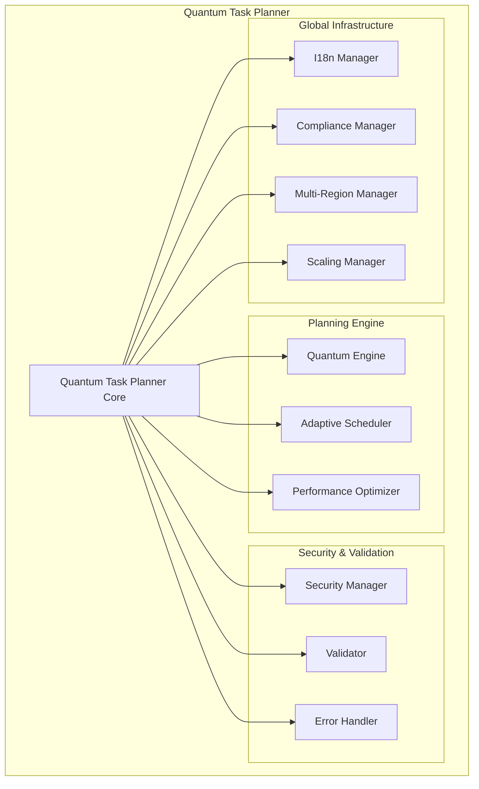

# Quantum-Inspired Task Planner

## Overview

The Quantum-Inspired Task Planner is a revolutionary approach to task scheduling
and optimization that leverages principles from quantum computing to achieve
superior performance in complex task planning scenarios. Built as part of the
Lang Observatory platform, it provides intelligent, adaptive, and globally-aware
task orchestration.

## Key Features

### 🔬 Quantum-Inspired Algorithms

- **Superposition**: Explores multiple task execution states simultaneously
- **Entanglement**: Identifies and optimizes complex task dependencies
- **Coherence Management**: Maintains system stability and predictability
- **State Collapse**: Converges to optimal execution plans

### 🛡️ Enterprise Security

- **Multi-layered Authentication**: JWT with refresh token rotation
- **Role-based Access Control**: Granular permissions system
- **Rate Limiting**: Protection against abuse and DoS attacks
- **Audit Logging**: Comprehensive security event tracking
- **Data Encryption**: End-to-end encryption for sensitive data

### ⚡ Performance Optimization

- **Multi-level Caching**: L1 memory cache + L2 compressed storage
- **Intelligent Batching**: Automatic request aggregation
- **Worker Pool Management**: Dynamic resource allocation
- **Auto-scaling**: Horizontal scaling based on load metrics

### 🌍 Global-First Architecture

- **Multi-region Deployment**: Automatic region selection and failover
- **Data Sovereignty**: GDPR, CCPA, PDPA compliance built-in
- **Internationalization**: Support for 10+ languages
- **Compliance Automation**: Automated privacy rights handling

## Architecture



## Quick Start

### Installation

```bash
npm install @terragon-labs/lang-observatory
```

### Basic Usage

```javascript
const { QuantumTaskPlanner } = require('@terragon-labs/lang-observatory');

// Initialize with configuration
const planner = new QuantumTaskPlanner({
  quantum: {
    maxStates: 16,
    adaptiveThresholds: {
      priority: 0.7,
      efficiency: 0.8,
    },
  },
  security: {
    encryptionKey: process.env.ENCRYPTION_KEY,
    maxRequestsPerMinute: 100,
  },
  compliance: {
    frameworks: ['GDPR', 'CCPA'],
    dataResidency: 'EU',
  },
  multiRegion: {
    regions: ['us-east-1', 'eu-west-1', 'ap-southeast-1'],
    primaryRegion: 'us-east-1',
  },
});

// Initialize the planner
await planner.initialize();

// Define tasks
const tasks = [
  {
    id: 'data-processing',
    priority: 0.9,
    estimatedDuration: 120,
    requiredResources: ['cpu', 'memory'],
    type: 'data_processing',
  },
  {
    id: 'model-training',
    priority: 0.95,
    estimatedDuration: 300,
    requiredResources: ['gpu', 'memory'],
    dependencies: ['data-processing'],
  },
];

// Plan tasks with user context
const user = {
  userId: 'user123',
  role: 'planner',
  locale: 'en',
  location: 'EU',
};

const plan = await planner.planTasks(
  tasks,
  {
    maxConcurrency: 3,
    deadline: new Date(Date.now() + 24 * 60 * 60 * 1000),
  },
  user
);

console.log('Optimized Plan:', plan);
```

## Configuration Options

### Quantum Engine Configuration

```javascript
{
  quantum: {
    maxStates: 16,              // Maximum quantum states per task
    adaptiveThresholds: {
      priority: 0.7,            // Priority threshold for optimization
      efficiency: 0.8,          // Minimum efficiency requirement
      convergence: 0.95         // Convergence threshold
    },
    errorHandling: {
      circuitBreakerThreshold: 5,    // Failures before circuit opens
      circuitBreakerTimeout: 30000,  // Circuit breaker timeout (ms)
      enableFallback: true            // Enable classical fallback
    }
  }
}
```

### Security Configuration

```javascript
{
  security: {
    encryptionKey: 'your-32-char-encryption-key',
    saltRounds: 12,
    tokenExpiry: 3600000,           // 1 hour
    maxRequestsPerMinute: 100,
    enableAuditLogging: true,
    maxAuditEntries: 10000
  }
}
```

### Performance Configuration

```javascript
{
  performance: {
    maxCacheEntries: 10000,
    cacheTTL: 3600000,             // 1 hour
    enableCompression: true,
    compressionThreshold: 1024,    // bytes
    batchSize: 50,
    maxWorkers: 4
  }
}
```

### Multi-Region Configuration

```javascript
{
  multiRegion: {
    regions: ['us-east-1', 'eu-west-1', 'ap-southeast-1'],
    primaryRegion: 'us-east-1',
    loadBalancingStrategy: 'latency_based', // or 'round_robin', 'least_loaded'
    replication: {
      enabled: true,
      strategy: 'async',
      consistency: 'eventual'
    },
    disasterRecovery: {
      enabled: true,
      rpo: 3600,    // Recovery Point Objective (seconds)
      rto: 1800     // Recovery Time Objective (seconds)
    }
  }
}
```

### Compliance Configuration

```javascript
{
  compliance: {
    frameworks: ['GDPR', 'CCPA', 'PDPA'],
    dataRetention: {
      userData: 2555,        // days
      logData: 1095,         // days
      metricsData: 730       // days
    },
    anonymization: {
      method: 'hash',        // 'hash', 'tokenize', 'generalize'
      enableAutoAnonymization: true
    }
  }
}
```

## API Reference

### QuantumTaskPlanner Methods

#### `initialize()`

Initializes all planner components and dependencies.

```javascript
await planner.initialize();
```

#### `planTasks(tasks, constraints, user)`

Plans task execution using quantum-inspired optimization.

**Parameters:**

- `tasks` (Array): Array of task objects
- `constraints` (Object): Planning constraints
- `user` (Object): User context for security and localization

**Returns:** Promise resolving to optimized execution plan

```javascript
const plan = await planner.planTasks(tasks, constraints, user);
```

#### `executeTask(taskId, options)`

Executes a planned task with monitoring and metrics collection.

```javascript
const result = await planner.executeTask('task-123', {
  timeout: 30000,
  retryCount: 3,
});
```

#### `getQuantumMetrics(user)`

Retrieves quantum planner metrics and performance data.

```javascript
const metrics = await planner.getQuantumMetrics(user);
```

### Task Object Schema

```javascript
{
  id: 'unique-task-identifier',          // Required: Unique task ID
  priority: 0.8,                         // Optional: Priority (0-1)
  estimatedDuration: 120,                // Optional: Duration in minutes
  deadline: '2024-12-31T23:59:59Z',      // Optional: ISO deadline
  type: 'data_processing',               // Optional: Task type
  complexity: 'high',                    // Optional: 'low', 'medium', 'high'
  requiredResources: ['cpu', 'memory'],  // Optional: Required resources
  dependencies: ['other-task-id'],       // Optional: Task dependencies
  metadata: {                            // Optional: Additional metadata
    description: 'Process customer data',
    category: 'analytics'
  }
}
```

### Constraints Object Schema

```javascript
{
  maxConcurrency: 4,                     // Maximum parallel tasks
  deadline: '2024-12-31T23:59:59Z',      // Overall deadline
  resourceAvailability: 0.8,             // Resource availability (0-1)
  maxStates: 16,                         // Quantum states limit
  preferences: {
    optimizeFor: 'speed',               // 'speed', 'efficiency', 'reliability'
    allowPartialExecution: false        // Allow incomplete execution
  }
}
```

## Error Handling

The planner implements comprehensive error handling with automatic recovery:

### Error Types

- **QUANTUM_COHERENCE_LOSS**: Quantum state corruption
- **SUPERPOSITION_COLLAPSE**: Unexpected state collapse
- **ENTANGLEMENT_BROKEN**: Dependency resolution failure
- **RESOURCE_EXHAUSTION**: Insufficient system resources
- **VALIDATION_FAILED**: Input validation errors
- **SECURITY_VIOLATION**: Security policy violations

### Recovery Strategies

1. **Automatic Fallback**: Switch to classical planning algorithms
2. **Circuit Breaker**: Temporary service protection
3. **Resource Throttling**: Dynamic resource management
4. **State Reinitialization**: Reset quantum state
5. **Graceful Degradation**: Reduced functionality maintenance

## Performance Optimization

### Caching Strategy

The planner implements a sophisticated multi-level caching system:

- **L1 Cache**: In-memory for fastest access
- **L2 Cache**: Compressed storage for larger datasets
- **Cache Invalidation**: TTL-based with manual purging
- **Cache Warming**: Proactive cache population

### Batch Processing

Automatic batching improves throughput:

```javascript
// Batch configuration
{
  batchSize: 50,           // Tasks per batch
  maxWaitTime: 1000,       // Max wait before processing (ms)
  adaptiveBatching: true   // Dynamic batch size adjustment
}
```

### Auto-scaling

Dynamic scaling based on metrics:

- CPU utilization > 80%
- Memory usage > 85%
- Queue size > 100 tasks
- Response time > 5 seconds

## Security Best Practices

### Authentication

```javascript
// Generate auth token
const authResult = await securityManager.generateAuthToken(
  'user123',
  'planner',
  ['PLAN_TASKS', 'VIEW_METRICS']
);

// Use token in requests
const user = {
  userId: 'user123',
  sessionId: authResult.sessionId,
  token: authResult.token,
};
```

### Authorization

Role-based permissions:

- **admin**: Full system access
- **planner**: Task planning and execution
- **executor**: Task execution only
- **viewer**: Read-only access
- **user**: Limited self-service access

### Data Protection

- Encryption at rest and in transit
- PII anonymization and pseudonymization
- Secure key management
- Regular security audits

## Compliance and Privacy

### GDPR Compliance

- **Right to Access**: Automated data export
- **Right to Erasure**: Secure data deletion
- **Right to Portability**: Standardized data formats
- **Data Protection by Design**: Built-in privacy controls

### CCPA Compliance

- **Right to Know**: Data category disclosure
- **Right to Delete**: Consumer data deletion
- **Right to Opt-Out**: Third-party sharing controls
- **Non-Discrimination**: Equal service guarantee

### Example Privacy Request

```javascript
// Handle data access request
const privacyResult = await complianceManager.handlePrivacyRequest({
  type: 'access',
  dataSubject: 'user123',
  framework: 'GDPR',
  anonymizationLevel: 'partial',
});
```

## Multi-Region Deployment

### Region Selection

Automatic region selection based on:

- User location and preferences
- Data sovereignty requirements
- Network latency and performance
- Regional compliance mandates

### Failover Process

1. Health monitoring detects failure
2. Traffic routing to healthy regions
3. Data replication verification
4. Service restoration notification

### Data Sovereignty

```javascript
// Enforce data residency
const request = {
  userLocation: 'EU',
  dataClassification: 'RESTRICTED',
  complianceRequired: ['GDPR'],
};

const result = await multiRegionManager.routeRequest(request);
// Automatically routes to EU regions only
```

## Monitoring and Metrics

### Key Performance Indicators

- **Planning Efficiency**: Task completion optimization
- **Resource Utilization**: System resource usage
- **Cache Hit Rate**: Caching effectiveness
- **Error Rate**: System reliability
- **Response Time**: Performance metrics
- **Throughput**: Requests per second

### Alerting

Configure alerts for:

- High error rates (> 5%)
- Poor performance (> 5s response time)
- Resource exhaustion (> 90% usage)
- Security violations
- Compliance breaches

### Dashboard Metrics

```javascript
const dashboard = await planner.getQuantumMetrics(user);

console.log('System Health:', {
  coherenceLevel: dashboard.coherenceLevel,
  efficiency: dashboard.avgEfficiency,
  throughput: dashboard.performanceMetrics.throughput,
  cacheHitRate: dashboard.performanceMetrics.cacheHitRate,
  complianceScore: dashboard.complianceMetrics.complianceScore,
});
```

## Troubleshooting

### Common Issues

#### Low Planning Efficiency

- **Cause**: Complex task dependencies or resource conflicts
- **Solution**: Simplify dependencies or increase resource allocation

#### High Memory Usage

- **Cause**: Large task sets or cache bloat
- **Solution**: Enable compression or increase cache eviction

#### Authentication Failures

- **Cause**: Expired tokens or incorrect permissions
- **Solution**: Refresh tokens or update user roles

#### Regional Routing Issues

- **Cause**: Data sovereignty conflicts or region unavailability
- **Solution**: Review compliance settings or check region health

### Debug Mode

Enable debug logging:

```javascript
const planner = new QuantumTaskPlanner({
  logging: {
    level: 'debug',
    enableMetrics: true,
  },
});
```

### Health Checks

```javascript
const health = await planner.getHealthStatus();

if (health.status !== 'healthy') {
  console.error('System unhealthy:', health.services);
}
```

## Advanced Usage

### Custom Validation Rules

```javascript
// Extend validator with custom rules
planner.validator.addCustomRule('businessHours', task => {
  const now = new Date();
  const hour = now.getHours();

  if (task.type === 'critical' && (hour < 9 || hour > 17)) {
    return { valid: false, error: 'Critical tasks only during business hours' };
  }

  return { valid: true };
});
```

### Custom Metrics

```javascript
// Add custom performance metrics
await planner.metrics.recordCustomMetric('business_metric', {
  value: 42,
  tags: { department: 'engineering', project: 'quantum' },
});
```

### Plugin System

```javascript
// Register custom plugins
planner.use(
  'customOptimizer',
  new CustomOptimizationPlugin({
    algorithm: 'genetic',
    generations: 100,
  })
);
```

## API Examples

### Planning ML Pipeline

```javascript
const mlPipeline = [
  {
    id: 'data-ingestion',
    type: 'data_processing',
    priority: 0.9,
    estimatedDuration: 60,
    requiredResources: ['network', 'storage'],
  },
  {
    id: 'feature-extraction',
    type: 'ml_processing',
    priority: 0.8,
    estimatedDuration: 120,
    requiredResources: ['cpu', 'memory'],
    dependencies: ['data-ingestion'],
  },
  {
    id: 'model-training',
    type: 'ml_training',
    priority: 0.95,
    estimatedDuration: 300,
    requiredResources: ['gpu', 'memory'],
    dependencies: ['feature-extraction'],
  },
];

const plan = await planner.planTasks(mlPipeline, {
  maxConcurrency: 2,
  deadline: new Date(Date.now() + 8 * 60 * 60 * 1000), // 8 hours
  optimizeFor: 'efficiency',
});
```

### Batch Task Execution

```javascript
// Execute multiple tasks
const results = await Promise.all(
  plan.adaptiveSchedules.map(schedule =>
    planner.executeTask(schedule.task.id, {
      priority: schedule.task.priority,
      timeout: schedule.estimatedDuration * 1000 * 1.5,
    })
  )
);

console.log('Execution Results:', results);
```

### Privacy Rights Management

```javascript
// Handle user data deletion request
const deletionResult = await planner.complianceManager.handlePrivacyRequest({
  type: 'erasure',
  dataSubject: 'user123',
  hardDelete: false, // Use anonymization
  framework: 'GDPR',
});

console.log('Data deletion completed:', deletionResult);
```

## Migration Guide

### From Classical Planners

1. **Assessment**: Evaluate existing task complexity
2. **Configuration**: Set up quantum-specific parameters
3. **Testing**: Run parallel validation tests
4. **Gradual Migration**: Phase in quantum planning
5. **Monitoring**: Track performance improvements

### Version Upgrades

Follow semantic versioning guidelines and check the
[CHANGELOG.md](../CHANGELOG.md) for breaking changes.

## Support and Community

- **Documentation**:
  [https://docs.terragon-labs.com](https://docs.terragon-labs.com)
- **GitHub Issues**:
  [https://github.com/terragon-labs/lang-observatory/issues](https://github.com/terragon-labs/lang-observatory/issues)
- **Community Forum**:
  [https://community.terragon-labs.com](https://community.terragon-labs.com)
- **Commercial Support**:
  [https://terragon-labs.com/support](https://terragon-labs.com/support)

## License

Licensed under the Apache-2.0 License. See [LICENSE](../LICENSE) for details.

## Contributing

We welcome contributions! Please see [CONTRIBUTING.md](../CONTRIBUTING.md) for
guidelines.
